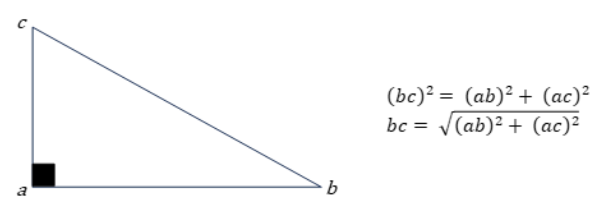

:hardbreaks:
:source-highlighter: rouge
= 4 Implémenter la collision entre un missile et un astéroïde

Cette fonctionnalité permet de détecter si deux objets sont en contact. On l'implémente : 

* Dans la classe ``FlyingObject`` pour pouvoir l'utiliser aussi avec le vaisseau plus tard 
* De manière statique pour pouvoir tester deux objets quelconques 

Les objets étant tous sphériques, il suffit de vérifier si la distance entre leurs centres respectifs est inférieure à la somme de leurs rayons respectifs. Pour calculer cette distance, il suffit d'utiliser le théorème de Pythagore : 

 
* Implémentez dans la classe ``FlyingObject`` la méthode statique suivante : 

[source,C++]
----
///////////////////////////// 
// Détermination de collision 
// calcul basé sur l'hypothèse que les objets sont sphériques 
// ------- 
// * o1, o2 : les deux objets à tester 
// ------- 
// Renvoie : true si les deux objets se touchent, false sinon 
static bool Collide(FlyingObject o1, FlyingObject o2);
----

Pour implémenter ce calcul, utilisez les fonctions ``sqrt`` et ``pow`` présentes dans la bibliothèque ``cmath``. 

* Modifiez le ``main`` pour que le missile atteigne un astéroïde, et le détruise (si vous avez du mal à trouver la bonne orientation du missile pour atteindre l'astéroïde, créez un astéroïde immobile). Veillez à correctement réserver et libérer la mémoire correspondante.