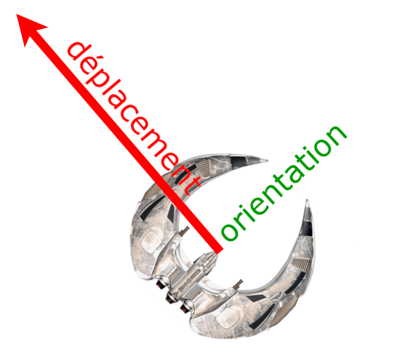
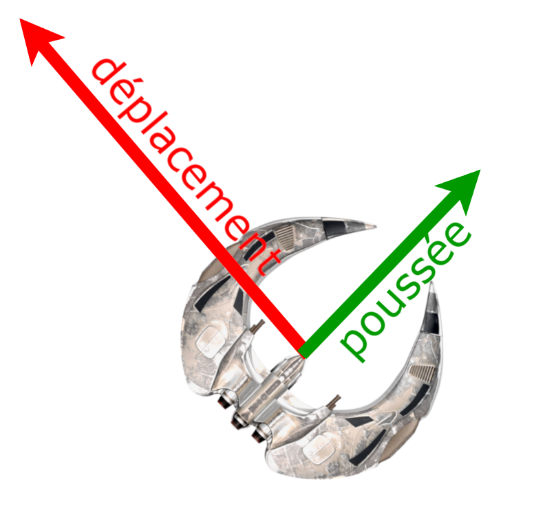
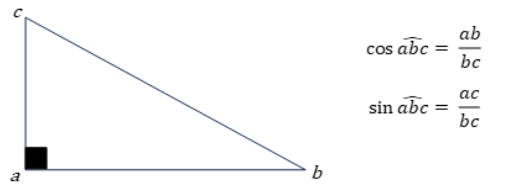

:hardbreaks:
:stem:
:source-highlighter: rouge
= 5 Créer une classe Spaceship

Cette classe permet de gérer (pas d'afficher) un vaisseau (création, déplacement, destruction). On implémentera ensuite l'affichage de ce missile dans la fonction ``main`` créée précédemment.  

Dans un premier temps, le vaisseau ne fait que se déplacer, sans tirer ni tenir compte des astéroïdes. 

Le vaisseau est défini par son vecteur de vitesse et son orientation. Ces deux notions sont différentes, car, une fois le vaisseau lancé, et sans intervention du joueur, il conserve indéfiniment sa vitesse de déplacement. Il peut pivoter, et ne plus se retrouver face à la direction de son déplacement. Si par exemple le vaisseau se déplace vers le haut/gauche, mais qu'il s'est orienté vers le haut/droit, il se retrouve dans cette position :

 

Il faut faire la distinction, car l'accélération (ou la décélération) est une poussée qui s'applique au vaisseau selon son orientation. Dans l'exemple précédent, accélérer va appliquer une poussée latérale : 

Cette poussée latérale va modifier le déplacement du vaisseau, en s'ajoutant au déplacement initial : 

 
image::spaceshipVector3.png[]
 

 

 

On va donc effectuer un calcul vectoriel (en l'occurrence une addition) : on va considérer un facteur d'accélération ou de décélération. Ce facteur est la longueur (la norme) du vecteur de poussée. Il faut donc convertir ce vecteur en poussée horizontale et en poussée verticale (ce sont les composantes de ce vecteur), puis ajouter (ou retrancher dans le cas de la décélération) ces composantes respectivement aux composantes horizontales et verticales de la vitesse du vaisseau. Pour effectuer cette conversion, il faudra dont utiliser les rapports trigonométriques : 

Le facteur de poussée correspond ici à la longueur de l'hypoténuse, et les longueurs des côtés adjacents sont la poussée horizontale et verticale qu'on veut calculer à partir de l'orientation du vaisseau. 

 

* Créez une classe ``Spaceship`` héritant de ``FlyingObject``, qui implémente le vaisseau, avec l'attribut :

[source,C++]
----
double angle; 
----
 
Implémentez les méthodes suivantes : 

[source,C++]
----
/////////////// 
// Constructeur 
// ------- 
// * x, y : coordonnées du centre de l'astéroïde, en pixels 
// * size : diamètre du vaisseau 
// * angle d'orientation 
Spaceship(double x, double y, double size, double angle);

////////// 
// Getters 
double GetAngle(); 

/////////////////////// 
// Accélère le vaisseau 
// ------- 
// * accelerationFactor : le facteur d'accéleration appliqué 
void SpeedUp(double accelerationFactor); 

/////////////////////// 
// Décélère le vaisseau 
// ------- 
// * decelerationFactor : le facteur de décéleration appliqué 
void SpeedDown(double decelerationFactor);

/////////////////////////// 
// Fait pivoter le vaisseau 
// -------
// * angle : l'angle de rotation, en degrés.  
void Rotate(double rAngle); 
----

Pour implémenter l'accélération et la décélération, vous utiliserez les fonctions ``cos`` et ``sin`` de la bibliothèque ``cmath``. Ces fonctions prennent en paramètre des angles en radians. Il vous faut donc aussi la formule de conversion d'un angle en degrés en angle en radians : 

 

[stem]
++++
angl\e_(radians)=(π*(180-angl\e_(degré)))/180
++++

 

Et on rappelle pour finir que la valeur π se trouve elle aussi dans la bibliothèque ``cmath`` (c'est la constante ``M_PI``).

* Modifiez la fonction ``main`` pour faire apparaitre le vaisseau, et implémenter les contrôles suivants : 
** Haut et Bas accélèrent et ralentissement le vaisseau 

** Gauche et Droite le font tourner 
Remarque : La méthode ``DrawShip`` du Framework utilise deux paramètres dont vous n'avez pas l'usage pour l'instant : 

*** ``shieldLevel`` : laissez ce paramètre à ``0.0`` 

*** ``warning`` : laissez ce paramètre à ``false`` 

 

 