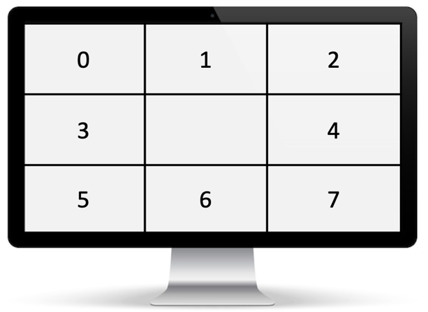

:hardbreaks:
= Initialiser aléatoirement l'astéroïde

Cette fonctionnalité permet de définir un positionnement aléatoire lors de la création d'un astéroïde. 

 

Description générée automatiquementPour positionner l'astéroïde, on considère un écran découpé en 9 parties (3x3), et on sélectionne aléatoirement l'une de ces parties en excluant la partie centrale occupée par le vaisseau. Il faut donc faire un tirage aléatoire entre 0 et 7 : 

 

Une fois la partie sélectionnée, on génère des coordonnées aléatoires dans cette zone. Il suffit de calculer les coordonnées minimales et maximales de la zone, et de faire un tirage aléatoire à l'intérieur de ces bornes. 

. Modifiez le Modèle pour que le positionnement de l'astéroïde lors de la création soit aléatoire. Vous utiliserez les classes ``uniform_int_distribution`` (pour la sélection de la zone) et ``uniform_real_distribution`` (pour la génération des coordonnées aléatoires dans la zone sélectionnée) de la librairie ``random``. 
+
Il faut aussi générer un déplacement aléatoire. Mais la vitesse en elle-même n'est pas aléatoire, c'est uniquement l'orientation qui l'est. Il faut donc tirer aléatoirement un angle entre -180° et 180°, puis calculer les vitesses horizontale et verticale, en utilisant le même calcul que pour l'application d'une poussée au vaisseau. 

. Modifiez le Modèle pour que l'orientation de l'astéroïde lors de la création soit aléatoire. Vous utiliserez la classe ``uniform_int_distribution`` de la librairie ``random``. 